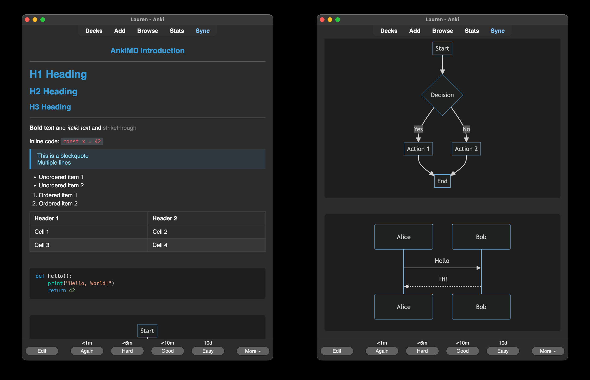

# AnkiMD

Markdown & Mermaid support for Anki flashcards.

## Features

- Full Markdown syntax (headers, bold, italic, strikethrough, lists, tables, blockquotes, links, images)
- Code blocks with syntax highlighting (VSCode Dark+ theme)
- Mermaid diagrams (offline, no internet required)
- Automatic "AnkiMD" note type creation

## Installation

1. Copy the `ankimd` folder to your Anki addons directory:
   - macOS: `~/Library/Application Support/Anki2/addons21/`
   - Windows: `%APPDATA%\Anki2\addons21\`
   - Linux: `~/.local/share/Anki2/addons21/`

2. Restart Anki

## Usage

1. Create a new card using the "AnkiMD" note type
2. Write Markdown in the Back field
3. Content renders when reviewing cards

## License

MIT
