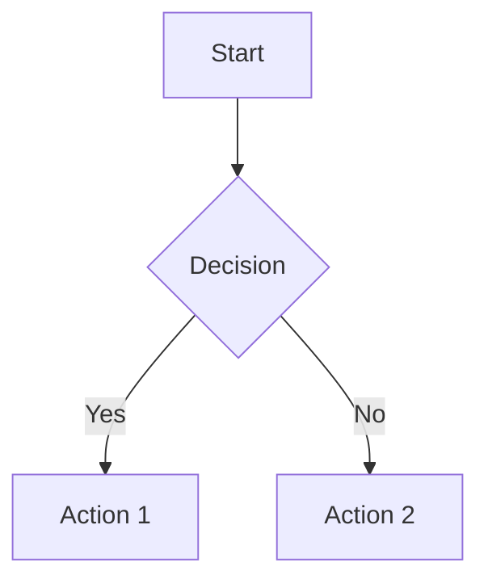

# AnkiMD

Markdown & Mermaid support for Anki flashcards.

## Features

- Full Markdown syntax support (headers, bold, italic, strikethrough, lists, tables, blockquotes, links, images)
- Code blocks with syntax highlighting (Pygments or built-in highlighter)
- Inline code styling
- Mermaid diagram rendering (offline, no internet required)
- VSCode Dark+ color scheme
- Automatic note type creation

## Installation

1. Copy the `ankimd` folder to your Anki addons directory:
   - macOS: `~/Library/Application Support/Anki2/addons21/`
   - Windows: `%APPDATA%\Anki2\addons21\`
   - Linux: `~/.local/share/Anki2/addons21/`

2. Restart Anki

3. The plugin automatically creates an "AnkiMD" note type

## Usage

1. Create a new card using the "AnkiMD" note type
2. Write Markdown in the Back field
3. The content will be rendered when reviewing cards

### Supported Syntax

```markdown
# H1 Heading
## H2 Heading
### H3 Heading

**Bold** and *italic* and ~~strikethrough~~

Inline code: `const x = 42`

> Blockquote

- Unordered list
- Item 2

1. Ordered list
2. Item 2

| Header 1 | Header 2 |
|----------|----------|
| Cell 1   | Cell 2   |

[Link](https://example.com)


```

### Code Blocks

~~~markdown
```python
def hello():
    print("Hello, World!")
```
~~~

### Mermaid Diagrams

~~~markdown

~~~

## Files

- `__init__.py` - Plugin entry point, hooks, note type creation
- `parser.py` - Markdown to HTML parser
- `highlighter.py` - Syntax highlighting (Pygments + fallback)
- `theme.py` - CSS styles
- `mermaid.min.js` - Bundled Mermaid library (offline support)

## Requirements

- Anki 2.1.x or later
- Optional: Pygments for enhanced syntax highlighting (`pip install Pygments`)

## Author

Lauren Wong

## License

MIT
