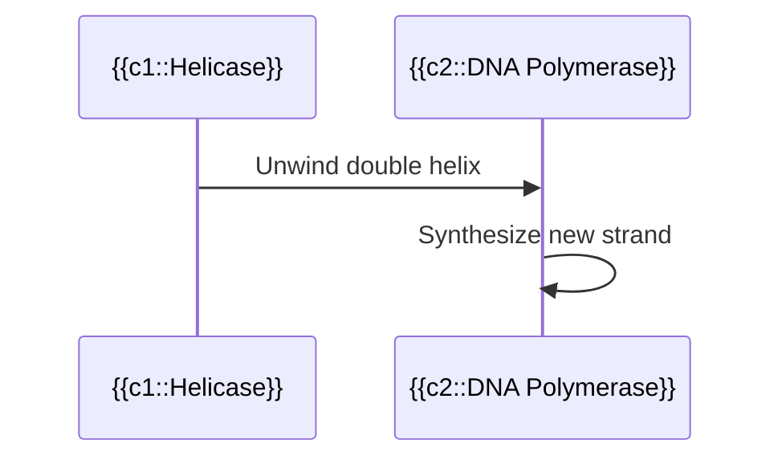
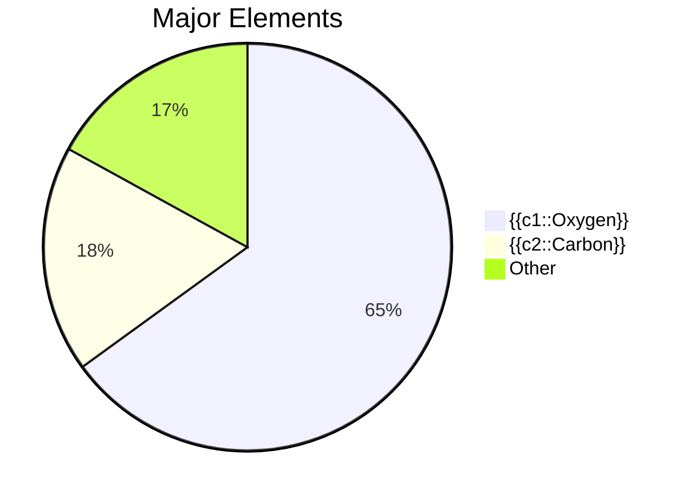

# AnkiMD Cloze Examples

## 1. Flowchart (graph)

**Text:**
```
## Glycolysis

```mermaid
graph LR
    A[Glucose] --> B[{{c1::Pyruvate}}]
    B --> C[{{c2::Acetyl-CoA}}]
```
```

**Extra:** `Occurs in the cytoplasm`

---

## 2. Sequence Diagram (sequenceDiagram)

**Text:**
```
## DNA Replication


```

**Extra:** `Semi-conservative replication`

---

## 3. State Diagram (stateDiagram)

**Text:**
```
## Cell Cycle

```mermaid
stateDiagram-v2
    [*] --> G1
    G1 --> S: {{c1::DNA Replication}}
    S --> G2
    G2 --> M: {{c2::Mitosis}}
    M --> [*]
```
```

**Extra:** `G1 checkpoint detects DNA damage`

---

## 4. Pie Chart (pie)

**Text:**
```
## Body Elements


```

**Extra:** `By mass percentage`

---

## 5. Class Diagram (classDiagram)

**Text:**
```
## Animal Classification

```mermaid
classDiagram
    Animal <|-- {{c1::Chordata}}
    Chordata <|-- {{c2::Mammalia}}
```
```

**Extra:** `Kingdom > Phylum > Class > Order > Family > Genus > Species`

---

## Usage

1. Select **AnkiMD Cloze** note type
2. Copy Text content to Text field
3. Copy Extra content to Extra field
4. Cloze syntax: `{{c1::content}}`
